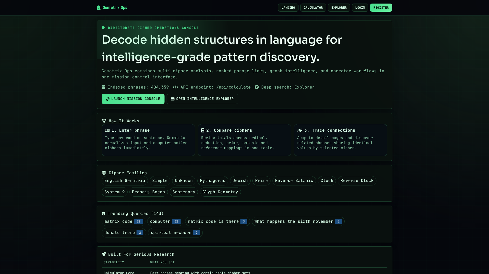
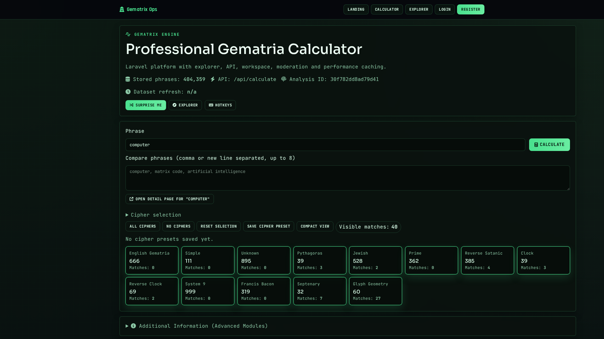
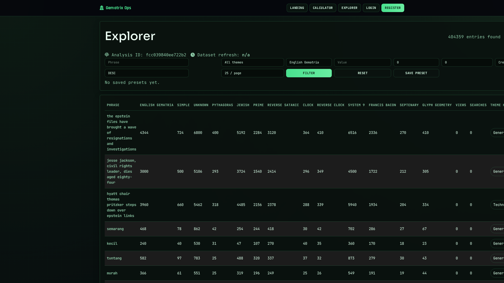
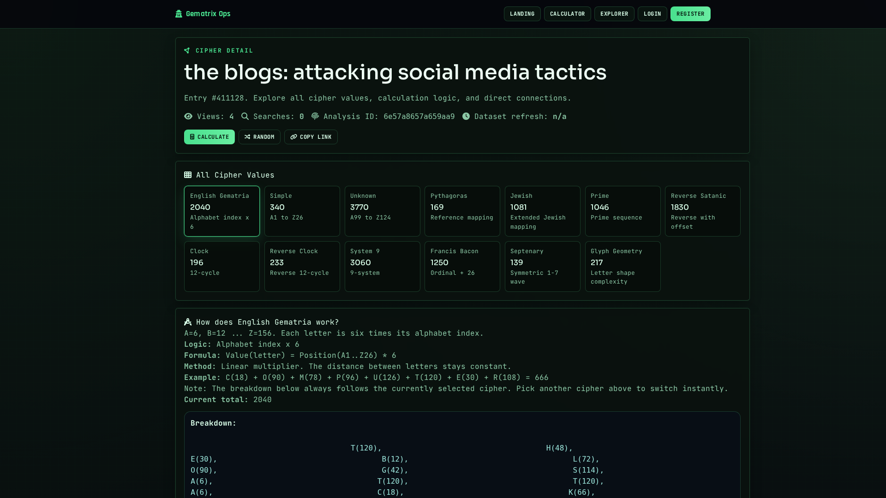

# Gematrix Ops

Gematrix Ops is a Laravel-based gematria platform with:
- multi-cipher phrase calculation
- calculator, explorer, and entry detail workflows
- admin moderation + analytics
- automated international news crawling
- phrase/word enrichment into the core dataset

## UI Screenshots

### Landing


### Calculator


### Explorer


### Entry Detail


## Stack

- Laravel 12 (PHP 8.4)
- PostgreSQL 16
- Redis 7
- Nginx
- Tailwind + DaisyUI
- Docker Compose

## Quick Start

```bash
docker compose up --build -d
```

App URL:
- `http://localhost:1339`

## Services

Defined in `docker-compose.yml`:
- `app` (PHP-FPM + Laravel)
- `nginx` (web server)
- `db` (PostgreSQL)
- `redis`
- `scheduler` (runs Laravel scheduler every minute)

## Ciphers

Current configured ciphers:
- `english_gematria`
- `simple_gematria`
- `unknown_gematria`
- `pythagoras_gematria`
- `jewish_gematria`
- `prime_gematria`
- `reverse_satanic_gematria`
- `clock_gematria`
- `reverse_clock_gematria`
- `system9_gematria`
- `francis_bacon_gematria`
- `septenary_gematria`
- `glyph_geometry_gematria`

Full details (formula, method, examples, A-Z values for every cipher):
- `docs/CIPHERS.md`

## News Crawler

### What it does

The crawler:
1. fetches RSS/Atom headlines from enabled sources
2. sanitizes headlines (source-suffix cleanup + mojibake repair)
3. normalizes numbers to words
4. computes all gematria ciphers
5. stores rows in `news_headlines`
6. syncs full headlines + single words into `phrases`

### Commands

Manual run:
```bash
docker compose exec -T app php artisan news:crawl-headlines --limit=120
```

Cleanup malformed/source-suffixed headlines:
```bash
docker compose exec -T app php artisan news:clean-source-suffixes --all
```

### Scheduler

Configured in `routes/console.php`:
- `news:crawl-headlines --limit=120` every 15 minutes

## Database

Important tables:
- `phrases`
- `news_sources`
- `news_headlines`
- `crawler_runs`
- `search_histories`

Run migrations:
```bash
docker compose exec -T app php artisan migrate --force
```

## Admin Access (Default)

- email: `admin@gematrix.local`
- password: `admin12345`
- dashboard: `/admin`

## Build / Test

Build frontend:
```bash
npm run build
```

Run tests:
```bash
docker compose exec -T app php artisan test
```

## API

- `GET /api/calculate?q=...`
- `GET /api/explorer?cipher=...&value=...`
- `GET /api/suggest?q=...`
- `GET /api/hybrid-search?q=...&limit=...`
